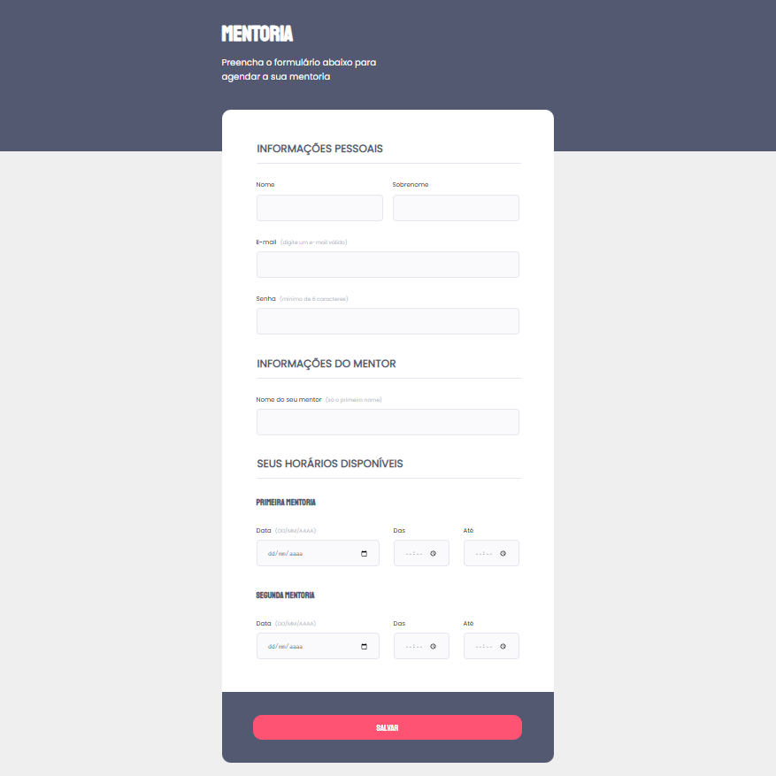

# Projeto 5 

> Trilha Explorer

Projeto desenvolvido durante o curso Explorer da Rocketseat, ao final do módulo de formulários, validações e customizações, como desafio. 

[Clique aqui para acessar](https://desenvjonathan.github.io/projeto05/)

## Tecnologias

- HTML
- CSS
- Git e Github

## Contatos

- E-mail: desenvjonathan@hotmail.com
- LinkedIn: https://www.linkedin.com/in/jonathan-ramos-p/